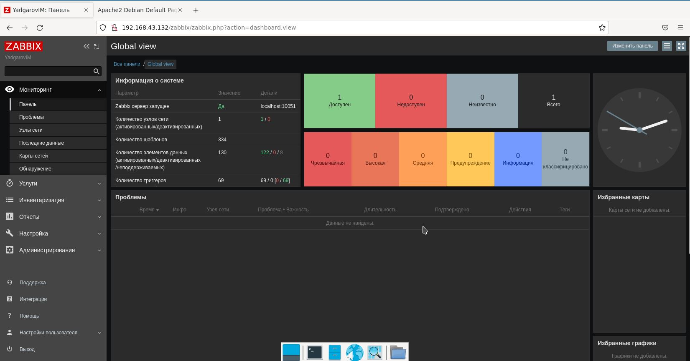
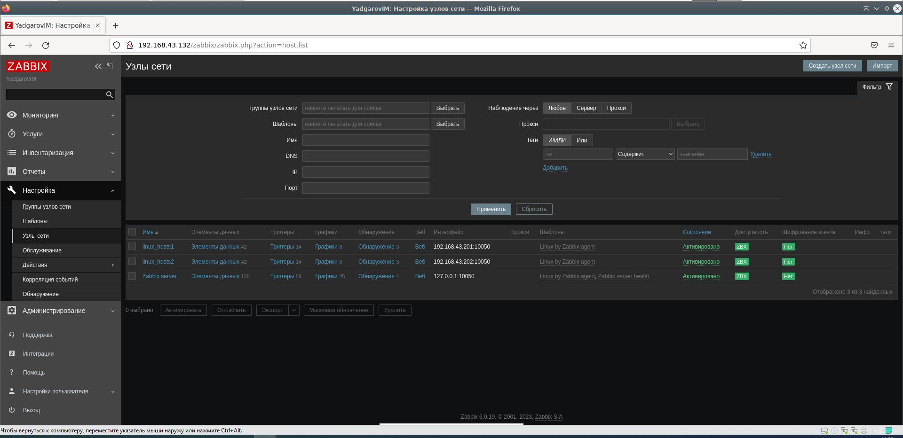
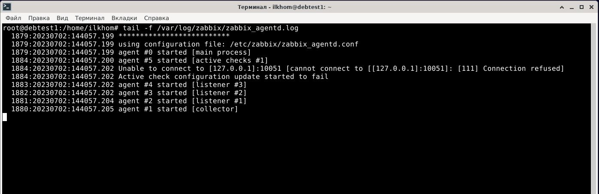
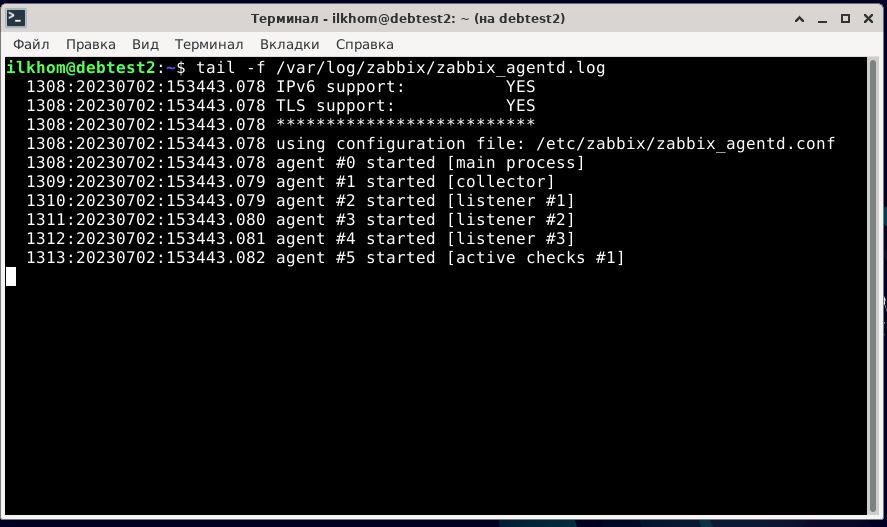
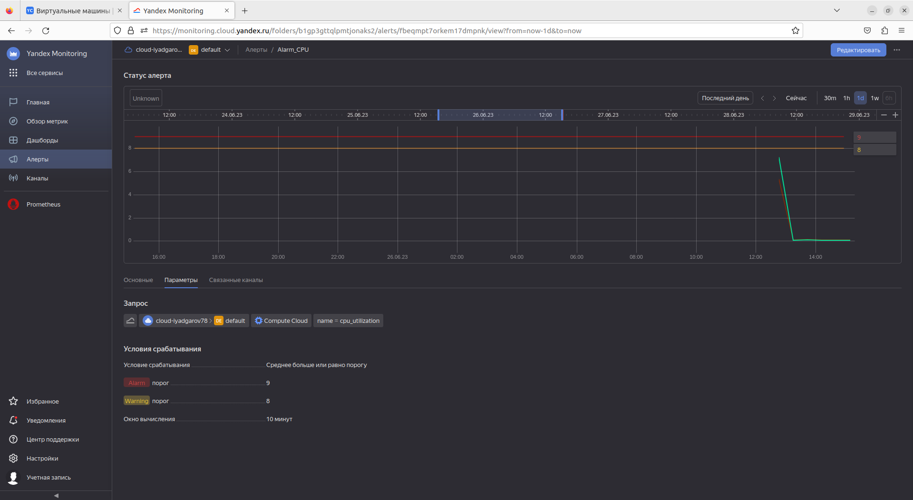
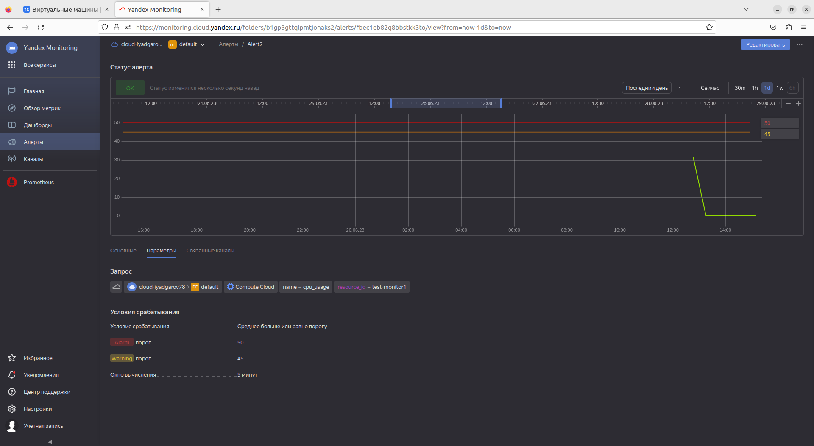
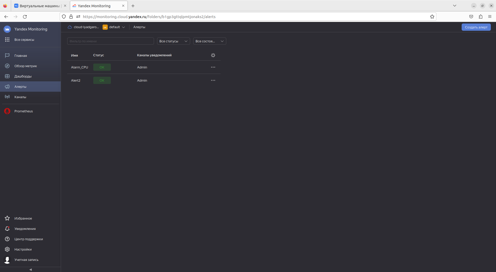

# Домашнее задание к занятию "`Система мониторинга Zabbix`" - `Ильхом Ядгаров`

### Задание 1

"Установите Zabbix Server с веб-интерфейсом."

1. " # sudo apt install postgresql - "ВЫПОЛНЕНО!""
2. " # wget https://repo.zabbix.com/zabbix/6.0/debian/pool/main/z/zabbix-release/zabbix-release_6.0-4+debian11_all.deb - "ВЫПОЛНЕНО!""
3. " # dpkg -i zabbix-release_6.0-4+debian11_all.deb  - "ВЫПОЛНЕНО!""
4. " # apt update  - "ВЫПОЛНЕНО!""
5. " # apt install zabbix-server-pgsql zabbix-frontend-php php7.4-pgsql zabbix-apache-conf zabbix-sql-scripts zabbix-agent  - "ВЫПОЛНЕНО!""
6. su - postgres -c 'psql --command "CREATE USER zabbix WITH PASSWORD '\'123456789\'';"' - "ВЫПОЛНЕНО!"
7. zcat /usr/share/zabbix-sql-scripts/postgresql/server.sql.gz | sudo -u zabbix psql zabbix  - "ВЫПОЛНЕНО!"
8. sed -i 's/# DBPassword=/DBPassword=123456789/g' /etc/zabbix/zabbix_server.conf  - "ВЫПОЛНЕНО!"
9. systemctl restart zabbix-server zabbix-agent apache2  - "ВЫПОЛНЕНО!"
10. systemctl enable zabbix-server zabbix-agent apache2 - "ВЫПОЛНЕНО!"

Сделайте скриншот.  

### Задание 2

Установите Zabbix Agent на два хоста.

1. " # su "
2. " # wget https://repo.zabbix.com/zabbix/6.0/debian/pool/main/z/zabbix-release/zabbix-release_6.0-4+debian11_all.deb"
3. " # dpkg -i zabbix-release_6.0-4+debian11_all.deb"
4. " # apt update"
5. " # apt install zabbix-agent"
6. " # systemctl enable zabbix-agent"

скриншот раздела Configuration > Hosts, где видно, что агенты подключены к серверу

скриншот лога zabbix agent, где видно, что он работает с сервером
"agent1"

"agent2"

скриншот раздела Monitoring > Latest data для обоих хостов, где видны поступающие от агентов данные.

## Дополнительные задания (со звездочкой*)

Эти задания дополнительные (не обязательные к выполнению) и никак не повлияют на получение вами зачета по этому домашнему заданию. Вы можете их выполнить, если хотите глубже и/или шире разобраться в материале.

### Задание 2

Первый скриншот

Второй скриншот

Третий скриншот

