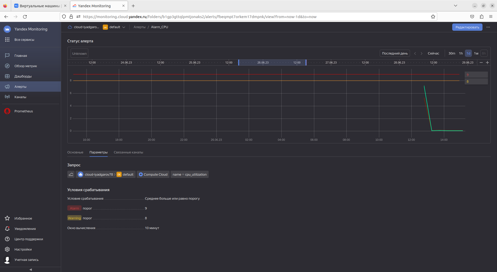
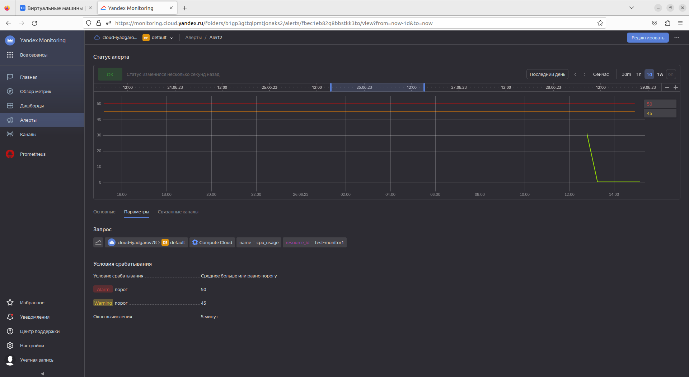

# Домашнее задание к занятию "`Обзор систем IT-мониторинга`" - `Ильхом Ядгаров`

### Задание 1

1. В окне браузера откройте облачную платформу Yandex Cloud  - "ВЫПОЛНЕНО!"
2. Перейдите в раздел "Все сервисы" > "Инфраструктура и сеть" > "Compute Cloud"  - "ВЫПОЛНЕНО!"
3. Нажмите на синюю кнопку "Создать ВМ" в правом верхнем углу окна браузера  - "ВЫПОЛНЕНО!"
4. Задайте имя виртуальной машины. Используйте английские буквы и цифры.  - "ВЫПОЛНЕНО!"
5. Выберите операционную систему Debian 11  - "ВЫПОЛНЕНО!"
6. Установите объём HDD равный 3ГБ  - "ВЫПОЛНЕНО!"
7. Выберите платформу Intel Ice Lake  - "ВЫПОЛНЕНО!"
8. Установите количество vCPU равное 2  - "ВЫПОЛНЕНО!"
9. Установите гарантированную долю vCPU равную 20%  - "ВЫПОЛНЕНО!"
10. Задайте количество RAM равное 1ГБ  - "ВЫПОЛНЕНО!"
11. Поставьте галочку "Прерываемая"  - "ВЫПОЛНЕНО!"
12. В разделе "Доступ" выберите сервисный аккаунт с ролью monitoring.editor. Если такого аккаунта нету, нажмите на кнопку "Создать новый". Задайте имя аккаунта английскими буквами, напротив надписи "Роли в каталоге" нажмите на знак "плюс". Прокручивая колесо мыши на себя, найдите роль monitoring.editor и нажмите на неё левой кнопкой мыши. Теперь вы сможете найти только что созданную роль в выпадающем списке аккаунтов.  - "ВЫПОЛНЕНО!"
13. Задайте логин учётной записи вашей виртуальной машины.  - "ВЫПОЛНЕНО!"
14. Вставьте публичный SHH-ключ в поле SSH-ключ. Если этого ключа у вас нету, создайте его с помощью утилиты PuTTYgen.  - "ВЫПОЛНЕНО!"
15. Поставьте галочку "Установить" в пункте "Агент сбора метрик".  - "ВЫПОЛНЕНО!"
16.	Нажмите на синюю кнопку "Создать ВМ"  - "ВЫПОЛНЕНО!"
17.	Перейдите в раздел "Все сервисы" > "Инфраструктура и сеть" > "Monitoring".  - "ВЫПОЛНЕНО!"
18.	Нажмите на кнопку "Создать дашборд", расположенную в разделе "Возможности сервиса" > "Дашборды".  - "ВЫПОЛНЕНО!"
19.	В открывшемся окне в разделе "Добавить виджет" нажмите на "График".  - "ВЫПОЛНЕНО!"
20.	Пред вам предстанет конструктор запросов, выберите "Запрос А".  - "ВЫПОЛНЕНО!"
21.	В параметре service конструктора запросов выберите Compute Cloud.  - "ВЫПОЛНЕНО!"
22.	В появившемся параметре name конструктора запросов выберите cpu_utilization.  - "ВЫПОЛНЕНО!"
23.	Поправьте диапазон времени отрисовки графика нажав на кнопку "Сейчас" в верху экрана, левее кнопок 3m, 1h, 1d, 1w, "Отменить".  - "ВЫПОЛНЕНО!"
24.	Нажмите на кнопку "Сохранить" в правом верхнем углу экрана.  - "ВЫПОЛНЕНО!"
25.	Задайте имя дашборда, если появится окно ввода имени дашборда.  - "ВЫПОЛНЕНО!"
26.	Сделайте скриншот.  

## Дополнительные задания (со звездочкой*)

Эти задания дополнительные (не обязательные к выполнению) и никак не повлияют на получение вами зачета по этому домашнему заданию. Вы можете их выполнить, если хотите глубже и/или шире разобраться в материале.

### Задание 2

Первый скриншот

Второй скриншот

Третий скриншот

